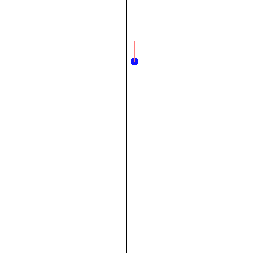

# DE-SAC
Contains supplementary simulation code for the work:

```
Ran Wang, Ye Tian and Kenji Kashima. 
"Density estimation based Soft Actor-Critic: deep reinforcement learning for static output feedback control with measurement noise" 
Advanced Robotics (2023).(pending review).
```

## Simulation Results

|                                  |                                                |
| :------------------------------: | :--------------------------------------------: |
|         `LinearEnv-v0`          |                 `MechArmEnv-v0`                 |
|  |                  |

In LinearEnv-v0, the blue point depicts the 2-dimensional states, and the red line depicts the 1-dimensional noisy outputs. Our purpose is to control the blue point to the origin.

In MechArmEnv, the green sphere depicts the target position, and the blue sphere depicts the noisy outputs (the end-effector position with measurement noise). Our purpose is to control the end-effector to the target position. Note that the 6-dimensional states are the angles of 6 joints. 

## Reference

[1] Raffin A, Hill A, Gleave A, et al. Stable-baselines3: Reliable reinforcement learning implementations. Journal of Machine Learning Research. 2021;22(268):1-8.

[2] https://github.com/qgallouedec/panda-gym

[3] https://github.com/UM-ARM-Lab/pytorch_kinematics

[4] https://github.com/kamenbliznashki/normalizing_flows