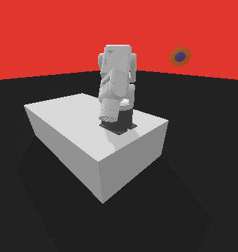

# DE-SAC
Contains supplementary simulation code for the work:

```
@article{wang2024density,
  title={Density estimation based soft actor-critic: deep reinforcement learning for static output feedback control with measurement noise},
  author={Wang, Ran and Tian, Ye and Kashima, Kenji},
  journal={Advanced Robotics},
  volume={38},
  number={6},
  pages={398--409},
  year={2024},
  publisher={Taylor \& Francis}
}
```
## Install
Before implementing our algorithm, we recommend you go through every testing file in the **test** folder to ensure every required Python package has been installed.

## Simulation Results

|                                  |                                                |
| :------------------------------: | :--------------------------------------------: |
|         `LinearEnv-v0`          |                 `MechArmEnv-v0`                 |
|  |                  |

In LinearEnv-v0, the blue point depicts the 2-dimensional states, and the length of the red line depicts the 1-dimensional noisy outputs. Our purpose is to control the blue point to the origin.

In MechArmEnv-v0, the green sphere depicts the target position, and the blue sphere depicts the noisy outputs (the end-effector position with measurement noise). Our purpose is to control the end-effector to the target position. Note that the 6-dimensional states are the angles of 6 joints. 

With the learned SOFC policy, we can achieve the control objectives against the measurement noise.

## Reference

[1] Raffin A, Hill A, Gleave A, et al. Stable-baselines3: Reliable reinforcement learning implementations. Journal of Machine Learning Research. 2021;22(268):1-8.

[2] https://github.com/qgallouedec/panda-gym

[3] https://github.com/UM-ARM-Lab/pytorch_kinematics

[4] https://github.com/kamenbliznashki/normalizing_flows
